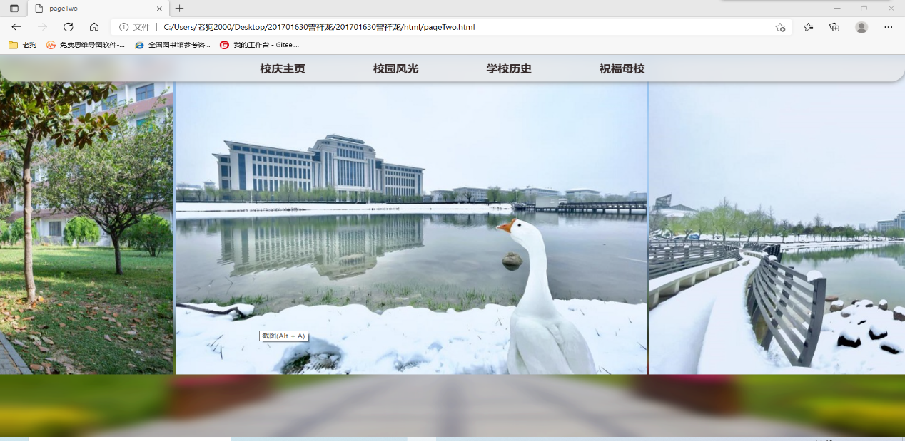
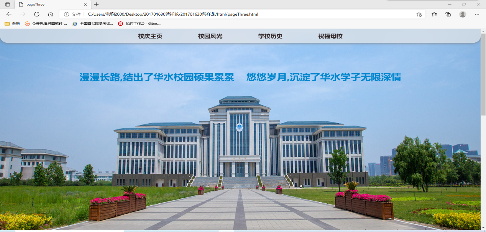
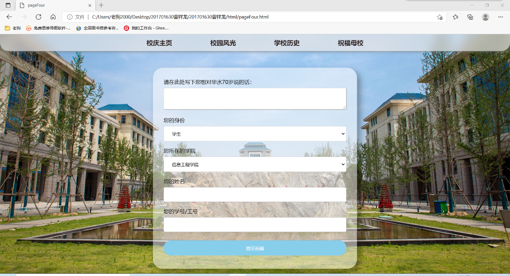

# School_Anniversary70
## 校庆70周年前端设计
### 相关技术运用：
* 使用HTML语言对网页进行底层的架构；
* 使用div标签进行页面定位；
* 使用CSS层叠样式表对页面进行统一的布局；
* 使用表单（form）控件对页面提供一定的交互；
* 使用JavaScript编写相应的功能函数。
### 主要栏目结构

### 校庆主页

### 校园风光

### 学校历史

### 祝福母校

***部分视频过大，未上传。***
